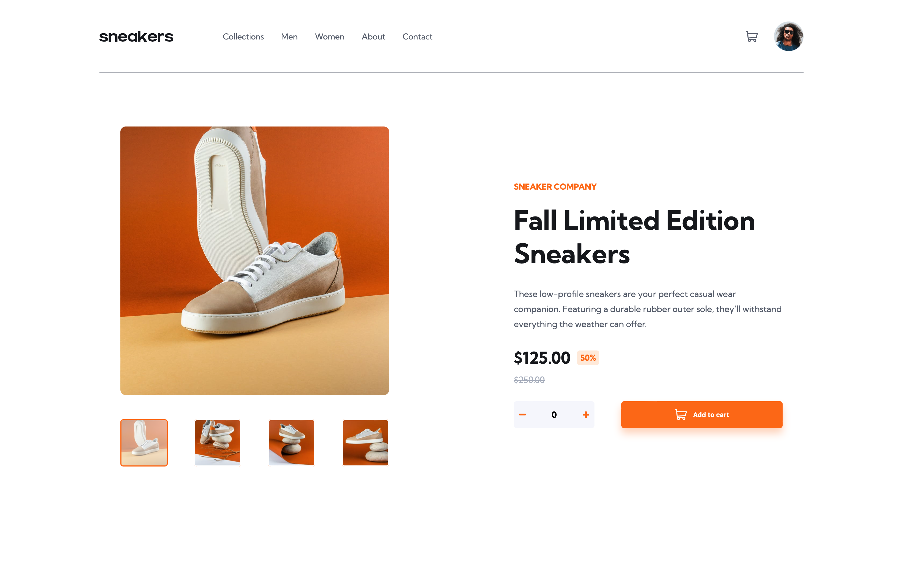

# This is my solution to challenge by FrontendMentor: e-Commerce Product Page

### Apart from making sure project looks the same as design files provided by Frontendmentor, I had to do the following:

- View the optimal layout for the site depending on their device's screen size
- See hover states for all interactive elements on the page
- Open a lightbox gallery by clicking on the large product image
- Switch the large product image by clicking on the small thumbnail images
- Add items to the cart
- View the cart and remove items from it

### Screenshot

### Links

- Solution URL: https://github.com/martinideniam/project-9-ecommerce-product-page
- Live Site URL: https://martinideniam.github.io/project-9-ecommerce-product-page/

### Built with

- Semantic HTML5 markup
- CSS custom properties
- Flexbox
- CSS Grid
